# CineAI Architecture Documentation

This document describes the technical architecture of the CineAI Movie Recommendation App, including system overview, data flow, and component structure.

## System Overview

CineAI is a modern web application built with Next.js 14, providing AI-powered movie recommendations through a clean, responsive interface.

### Core Technologies

- **Frontend**: Next.js 14 with App Router, TypeScript, Tailwind CSS, DaisyUI
- **Backend**: Next.js API Routes, Server Components
- **Database**: Supabase (PostgreSQL)
- **Authentication**: Supabase Auth
- **AI**: OpenAI GPT-5-mini (primary), Anthropic Claude API (fallback)
- **Movie Data**: TMDB API with caching
- **Memory System**: Unified UserMemoryService with recency decay
- **State Management**: React Query, React Context
- **Testing**: Jest, React Testing Library

## High-Level Architecture

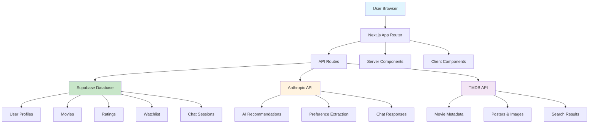

## Data Flow Architecture

### User Interaction Flow

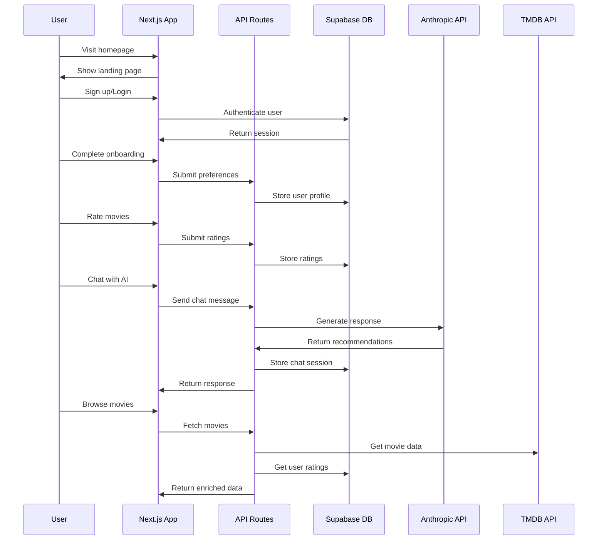

## Memory System Architecture

The CineAI memory system provides unified user context across all AI interactions through a centralized `UserMemoryService`.

### Memory System Flow

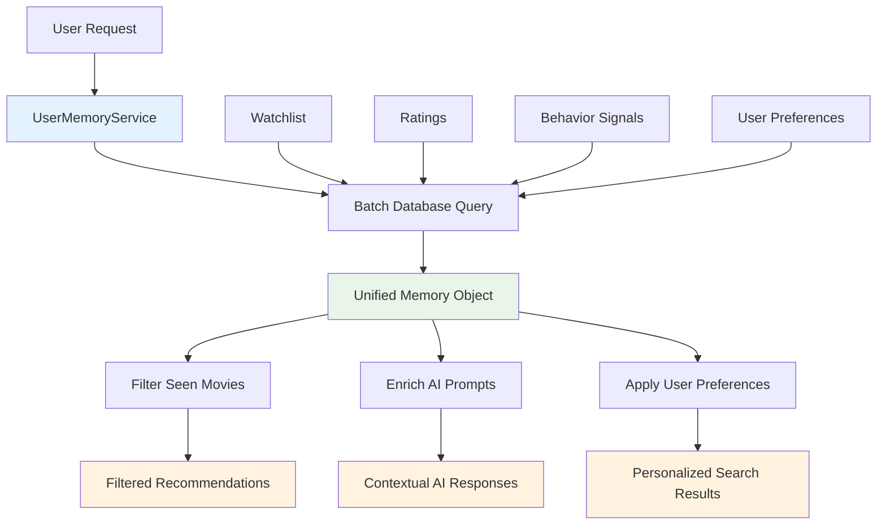

### Memory Components

1. **Unified Memory Aggregation**: Single batch query for all user data
2. **Recency Decay**: Time-based weighting (95% retention per day)
3. **Graceful Degradation**: App continues working if memory fails
4. **Cross-Endpoint Integration**: Consistent memory usage across chat, search, recommendations

### Memory Data Structure

```typescript
interface UserMemory {
  seenMovieIds: Set<number>           // Movies user has watched/rated
  ratedMovies: Rating[]              // User's movie ratings
  watchlistMovies: WatchlistItem[]   // User's watchlist
  genrePreferences: Map<string, number> // Genre weights with decay
  recentInteractions: BehaviorSignal[] // Recent user activity
  qualityThreshold: number            // User's quality standards
  explorationWeight: number          // Exploration vs exploitation balance
}
```

## AI Recommendation Pipeline

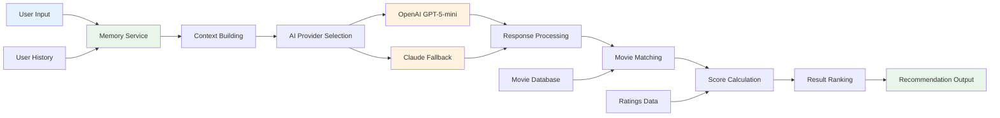

### AI Processing Steps

1. **Preference Extraction**: Parse user input for genres, moods, themes
2. **Context Building**: Combine user history, ratings, and current request
3. **Claude API Call**: Send enriched context to Anthropic Claude
4. **Response Processing**: Parse AI response for movie recommendations
5. **Movie Matching**: Match AI suggestions to database movies
6. **Score Calculation**: Calculate relevance scores based on user data
7. **Result Ranking**: Sort and filter recommendations
8. **Recommendation Output**: Return formatted recommendations

## Database Schema

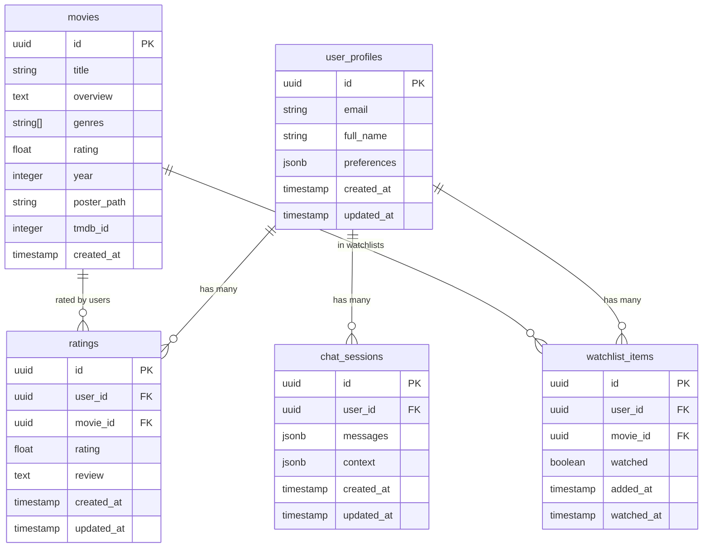

## Component Architecture

### App Router Structure

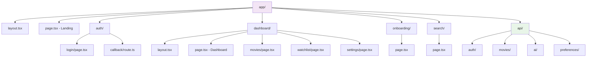

### Component Hierarchy

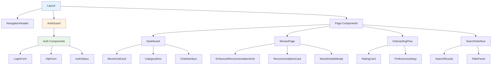

## API Architecture

### Route Organization

```mermaid
graph TD
    A[/api] --> B[/auth]
    A --> C[/movies]
    A --> D[/ai]
    A --> E[/preferences]
    A --> F[/watchlist]
    A --> G[/ratings]

    B --> B1[/login]
    B --> B2[/verify-otp]
    B --> B3[/status]

    C --> C1[GET - List movies]
    C --> C2[/search - Search movies]
    C --> C3[/[id] - Movie details]
    C --> C4[/genres - List genres]

    D --> D1[/chat - AI chat]
    D --> D2[/recommendations - Get recommendations]

    E --> E1[GET/POST - User preferences]
    E --> E2[/[id] - Update preferences]

    F --> F1[GET/POST - Watchlist items]
    F --> F2[/[id] - Update watchlist]

    G --> G1[POST - Submit ratings]

    style A fill:#e3f2fd
    style D fill:#fff3e0
```

## Authentication Flow

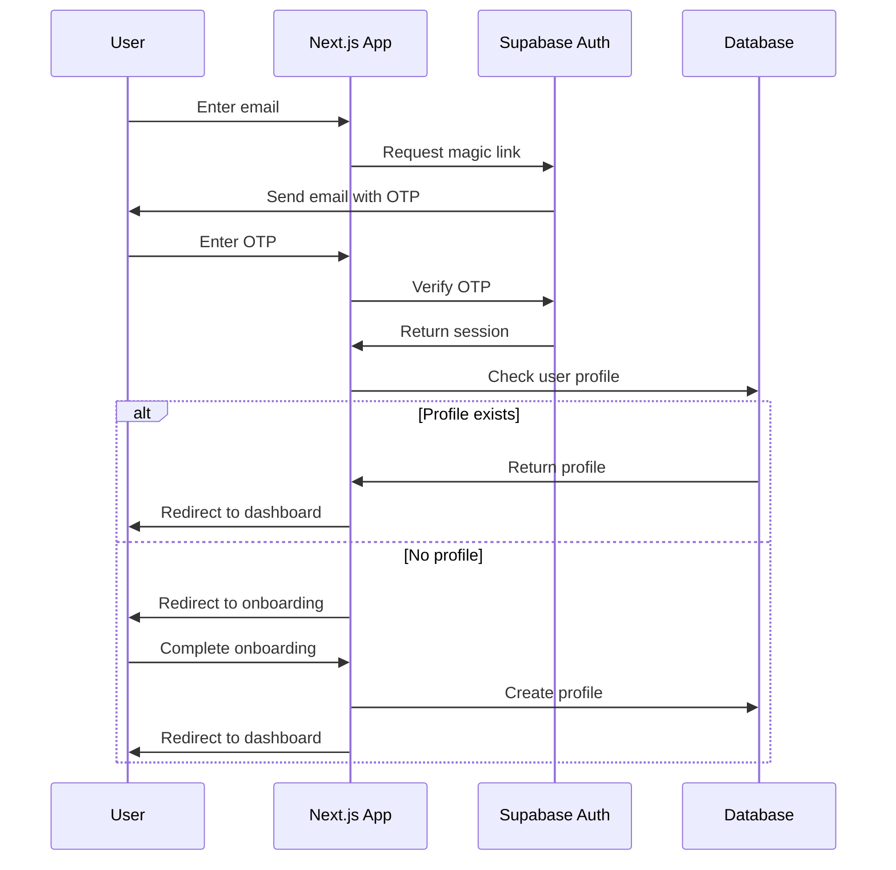

## State Management

### Context Providers

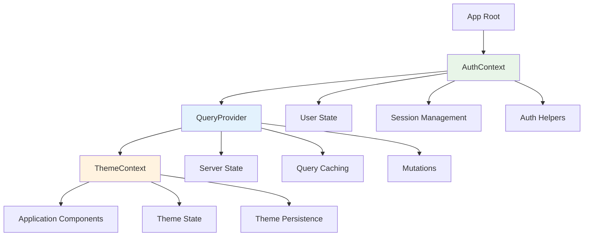

### Data Flow Patterns

1. **Server State**: Managed by React Query for API data
2. **Client State**: React Context for auth and theme
3. **Form State**: Uncontrolled components with validation
4. **URL State**: Next.js router for navigation state

## Performance Optimizations

### Caching Strategy

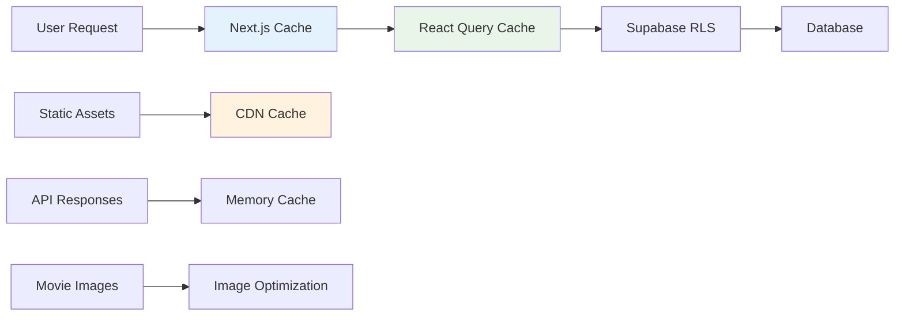

### Optimization Techniques

1. **Static Generation**: Landing pages and marketing content
2. **Server Components**: Data fetching on the server
3. **Code Splitting**: Lazy loading of non-critical components
4. **Image Optimization**: Next.js Image component with TMDB CDN
5. **Query Caching**: React Query for efficient data fetching
6. **Database Indexing**: Optimized queries for movie search

## Security Architecture

### Authentication & Authorization

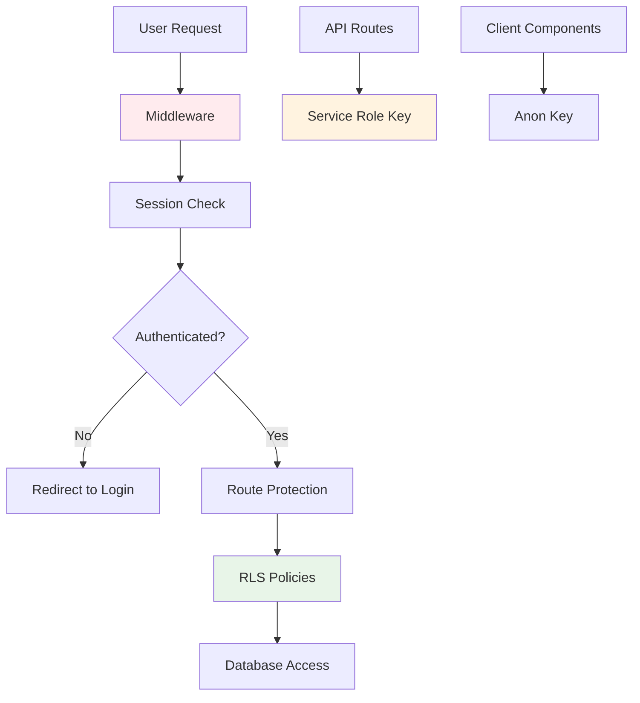

### Security Measures

1. **Row Level Security (RLS)**: Database-level access control
2. **Environment Variables**: Secure API key storage
3. **HTTPS Only**: All communications encrypted
4. **Input Validation**: Server-side validation for all inputs
5. **Rate Limiting**: API abuse prevention
6. **CSP Headers**: Content Security Policy implementation

## Deployment Architecture

### Production Stack

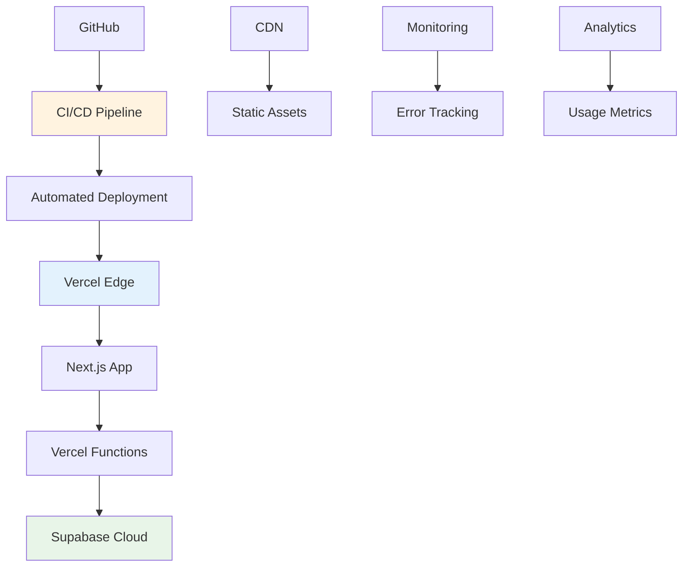

### Infrastructure Components

1. **Frontend Hosting**: Vercel with global CDN
2. **Database**: Supabase managed PostgreSQL
3. **Authentication**: Supabase Auth service
4. **File Storage**: Supabase Storage for user uploads
5. **Monitoring**: Vercel Analytics + custom error tracking
6. **CI/CD**: GitHub Actions with automated testing

## Development Workflow

### Code Organization

```
src/
├── app/                 # Next.js App Router
├── components/          # Reusable UI components
├── contexts/           # React Context providers
├── hooks/              # Custom React hooks
├── lib/                # Utilities and services
├── repositories/       # Data access layer
├── types/              # TypeScript type definitions
└── __tests__/          # Test files
```

### Testing Strategy

1. **Unit Tests**: Individual component and function testing
2. **Integration Tests**: API route and database testing
3. **E2E Tests**: Critical user journey testing
4. **Type Safety**: Comprehensive TypeScript coverage

This architecture provides a scalable, maintainable foundation for the CineAI application, emphasizing performance, security, and developer experience.
